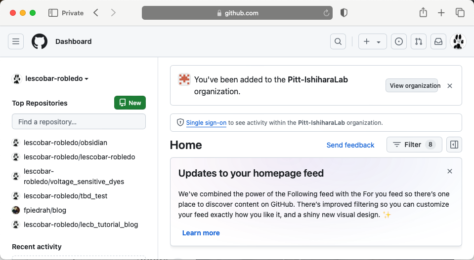
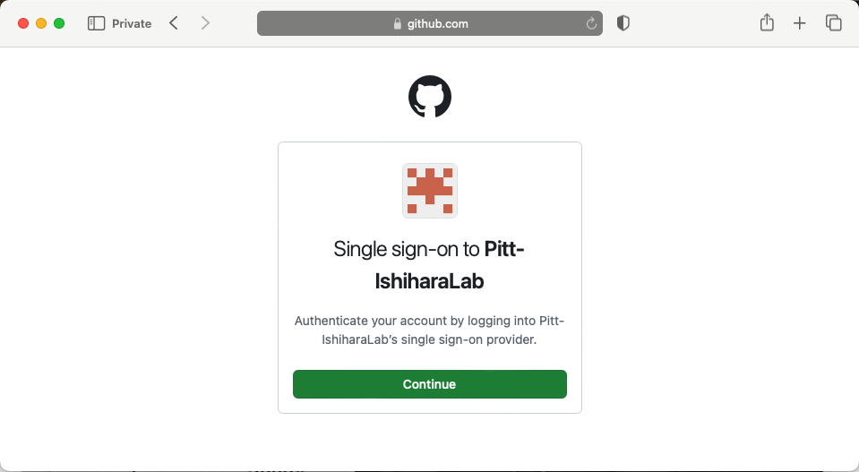
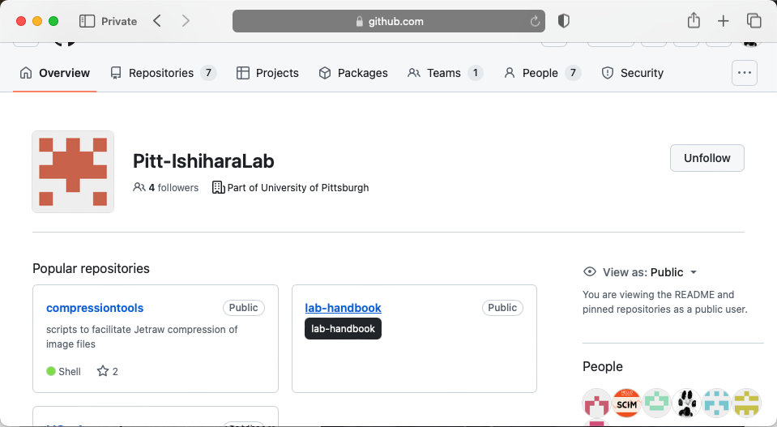
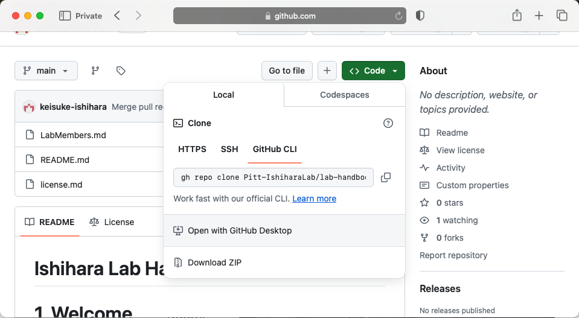
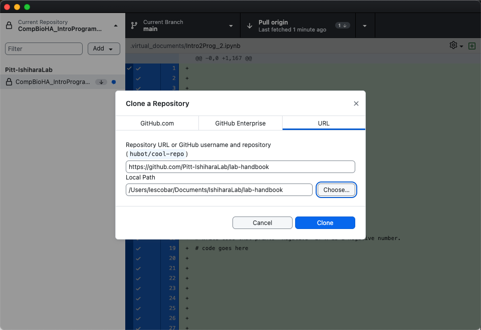
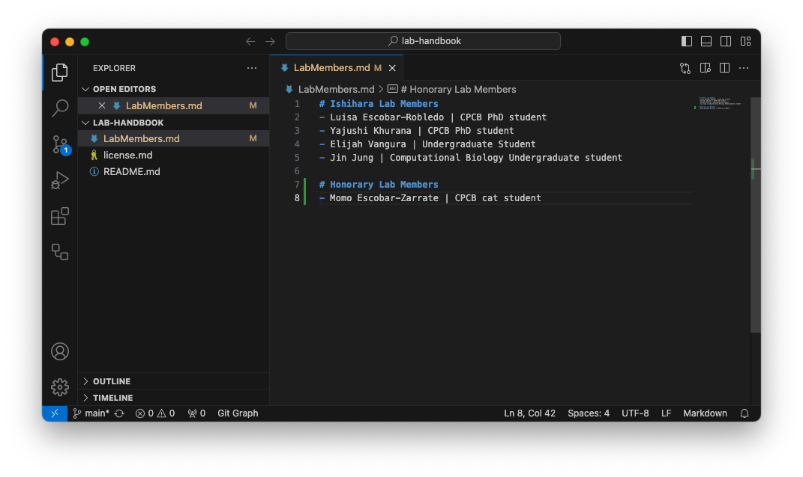
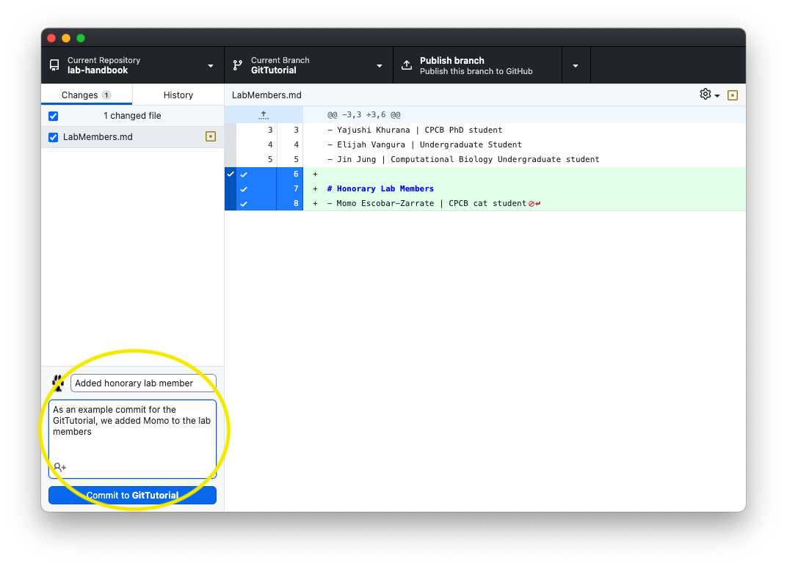
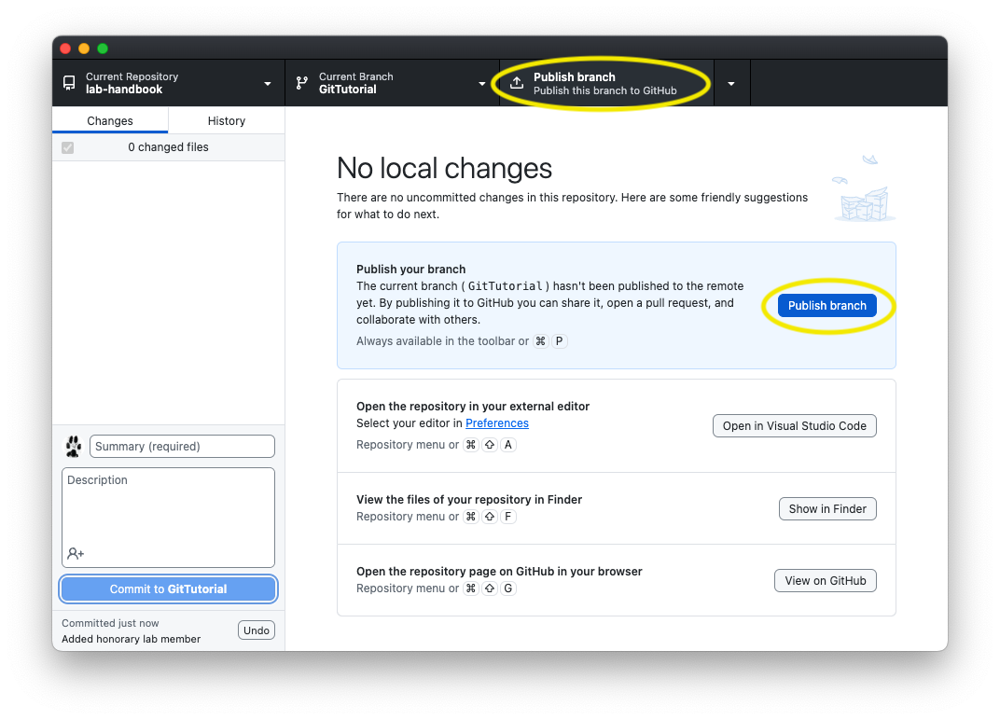
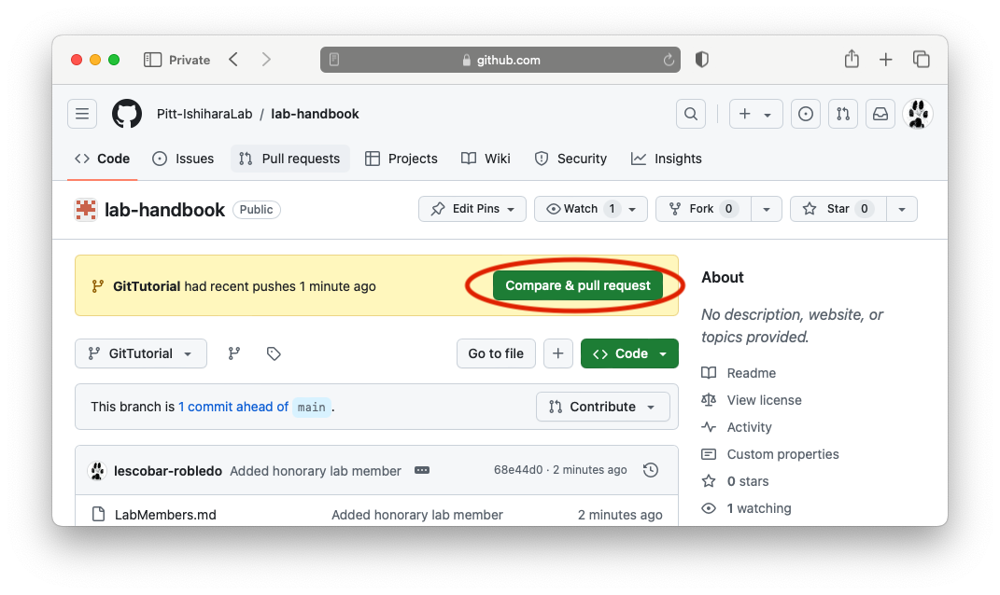
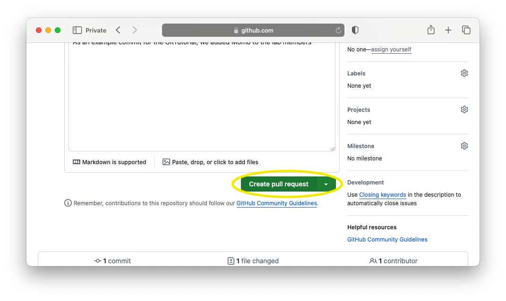

# Ishihara Lab Git Tutorial

The following tutorial is meant for be a step by step process to get familiar with Github and add your name to the Lab Handbook repository.

### 1. Login to your Github account

### 2. Click on the *Pitt-IshiharaLab* organization

### 3. Authenticate your *pitt id*

### 4. Open the *lab-handbook* repository

### 5. *Open with Github Desktop* to clone into your computer

### 6. Choose a destination folder on your computer and clone

### 7. Open with *Visual Studio* or your favorite code editor. Then edit the *LabMembers.md* and add your name and position to the Lab members section

### 8. On *Github Desktop* create a new branch with the name you want

### 9. Add a message and a description, then commit your changes

### 10. Publish your changes to the *IshiharaLab Github page*

### 11. Finally, open and create *Pull Request*

